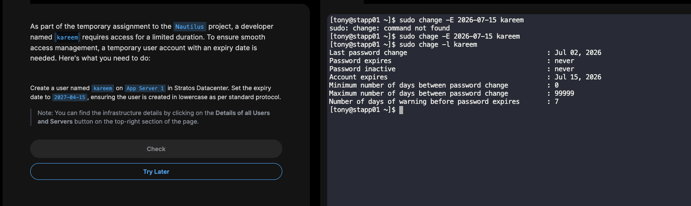

# Temporary User Setup with Expiry in Linux

## Description

This task demonstrates how to create a temporary user account in Linux and configure an account expiry date. Temporary accounts are commonly used for contractors, interns, vendors, or developers who need access for a limited period. Setting an expiry date ensures that access is automatically disabled after the specified date, improving system security and access management.

---

## Architecture

<p align="center">
  
</p>

> **Note:** Save your diagram or screenshot inside an **images/** folder and name it **temporary-user-setup.png**.

---

## Objective

- Create a new user account.
- Configure an account expiry date.
- Verify that the expiry date has been applied successfully.

---

## Commands Used

### Create a New User

```bash
sudo useradd -m kareem
```

### Set Account Expiry Date

```bash
sudo chage -E 2027-04-15 kareem
```

### Verify Account Expiry

```bash
sudo chage -l kareem
```

---

## Command Explanation

| Command | Description |
|----------|-------------|
| `sudo useradd -m kareem` | Creates a new user named **kareem** along with a home directory. |
| `sudo chage -E 2027-04-15 kareem` | Sets the account expiry date to **15 April 2027**. |
| `sudo chage -l kareem` | Displays the account ageing and expiry information. |

---

## Verification

Run the following command:

```bash
sudo chage -l kareem
```

Expected Output:

```text
Last password change : Jul 02, 2026
Password expires : never
Password inactive : never
Account expires : Apr 15, 2027
Minimum number of days between password change : 0
Maximum number of days between password change : 99999
Number of days of warning before password expires : 7
```

---

## Why This Is Important

- Improves system security.
- Automatically disables user access after the expiry date.
- Eliminates the need for manual account removal.
- Helps organizations enforce temporary access policies.
- Supports the Principle of Least Privilege (PoLP).

---

## Real-World Use Cases

- Temporary project developers
- Contract employees
- Third-party vendors
- Interns
- Guest users
- External consultants

---

## Key Takeaways

- `useradd` is used to create new Linux users.
- `chage` is used to manage password ageing and account expiry.
- Temporary accounts improve security by automatically revoking access.
- Always verify the configuration using `chage -l`.

---

## Author

**Sakshi Upadhyay**

DevOps | Docker | Kubernetes | Linux | AWS | CI/CD